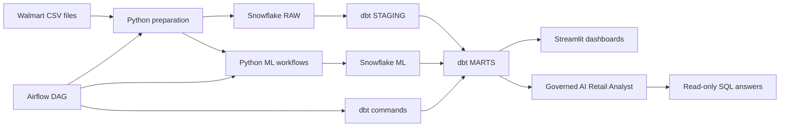

# Architecture

RetailIQ is designed as a layered data and AI platform for retail demand intelligence.

## Pipeline

```text
Local CSV / GCS
    -> Airflow orchestration
    -> Snowflake RAW
    -> dbt STAGING
    -> dbt MARTS
    -> Python ML outputs
    -> Snowflake ML
    -> dbt ML marts
    -> Streamlit dashboards
    -> AI Retail Analyst
```



## Layers

### Ingestion

Raw source files are stored locally in `data/sample/` during Phase 1. In Phase 2, downloaded Walmart files are placed in `data/raw/walmart/` and converted into canonical RetailIQ files. The ingestion script validates expected files, normalizes column names, and appends data into Snowflake `RAW` tables.

### Warehouse

Snowflake stores each major stage in a dedicated schema:

- `RAW`: source-aligned tables
- `STAGING`: typed and cleaned dbt models
- `MARTS`: analytics-ready facts and dimensions
- `ML`: forecasts, anomaly scores, features, and model outputs
- `ANALYTICS`: dashboard and AI analyst serving layer

### Transformation

dbt provides modular SQL transformations, lineage, tests, and documentation. Phase 2 includes staging views, enriched intermediate models, dimensional marts, sales facts, inventory facts, forecast facts, stockout risk facts, and anomaly facts.

### Orchestration

Airflow is available as an optional local orchestration layer. The `retailiq_phase2_pipeline` DAG validates Walmart source files, prepares canonical CSVs, optionally uploads to GCS, loads Snowflake raw and ML tables, trains the baseline forecast model, generates ML outputs, and runs dbt marts/tests.

### Machine Learning

Python workflows train a baseline demand forecasting model, generate prediction outputs, score stockout risk, and detect anomalies. Generated CSV outputs land in `data/ml_outputs/`, then load into Snowflake `ML` tables and dbt marts.

### Application

Streamlit is the primary presentation layer. It shows executive KPIs, forecasting trends, inventory risk, anomalies, data quality checks, and an early analyst workflow backed by Snowflake marts.

### AI

The AI Retail Analyst uses OpenAI to interpret business questions, generate governed read-only SQL, execute against Snowflake, and summarize results in business language. SQL guardrails restrict the analyst to approved `MARTS` objects, block writes and account metadata, enforce row limits, and show generated SQL for traceability.
